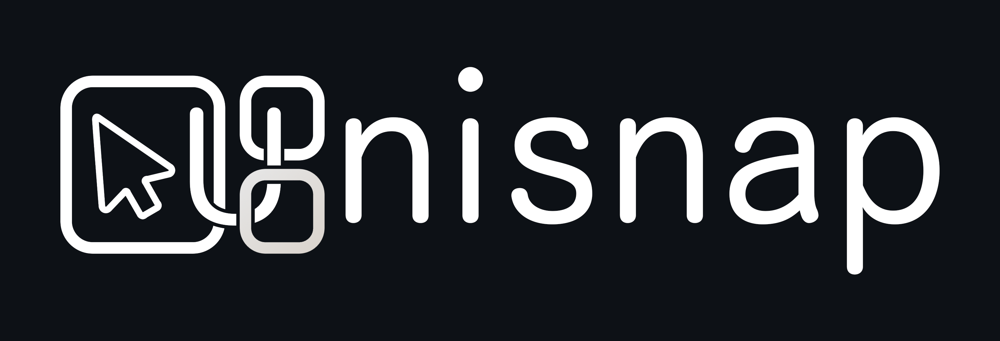
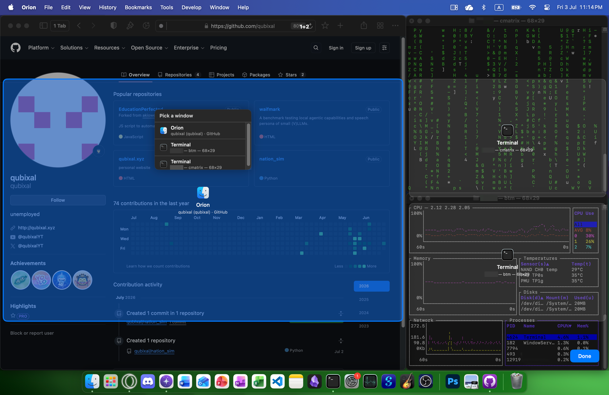
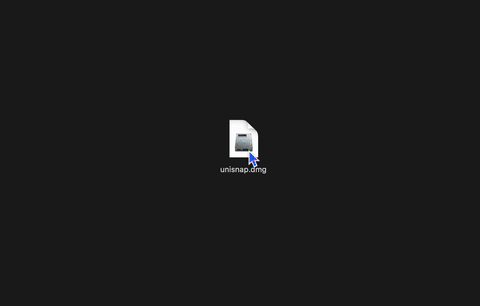
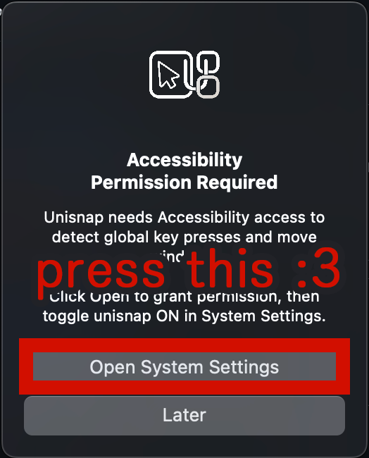
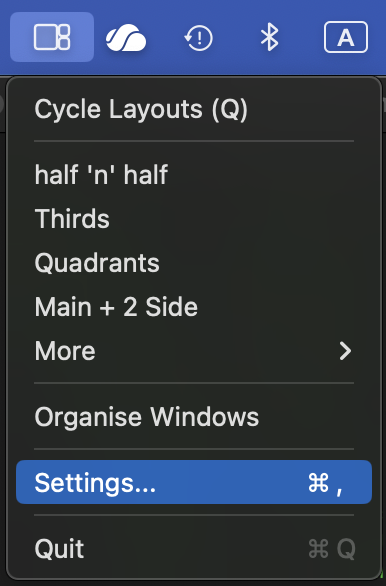
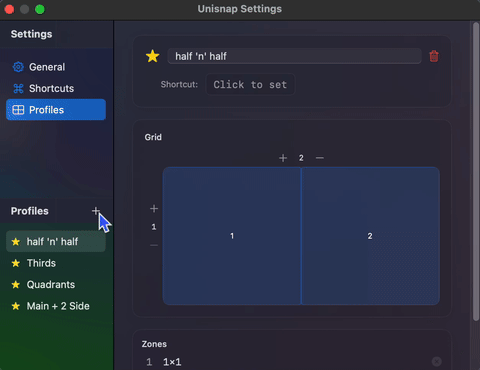
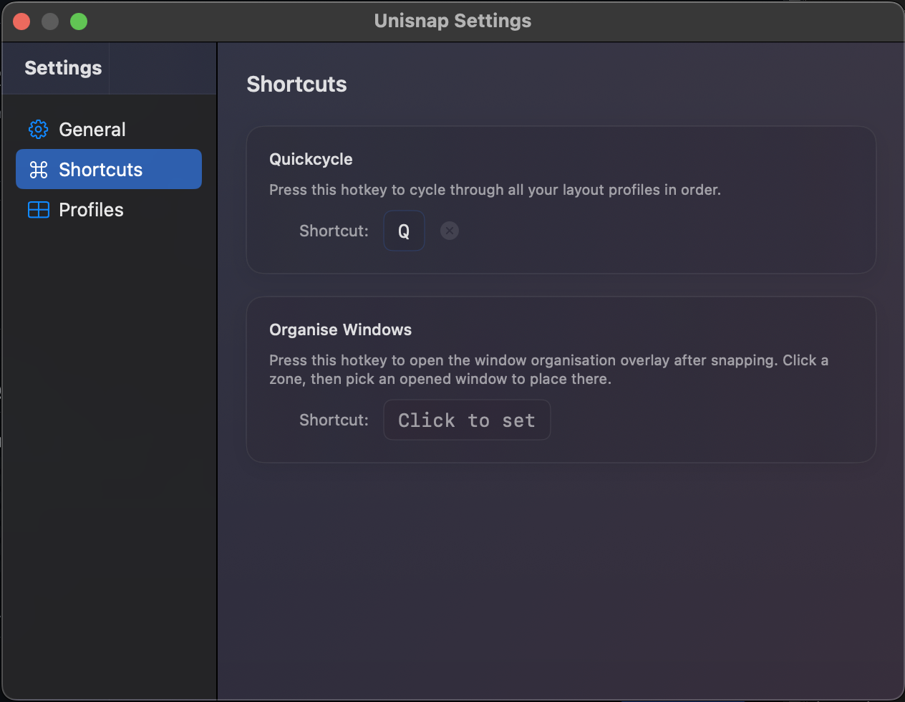
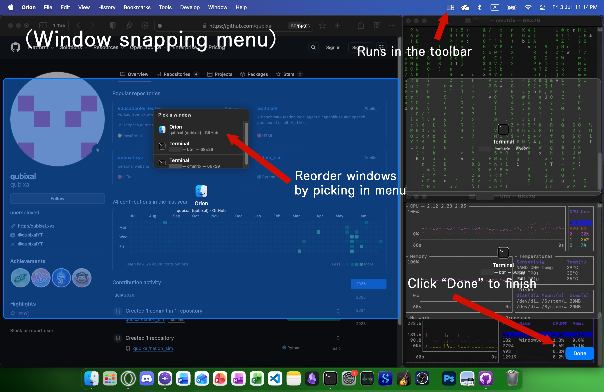
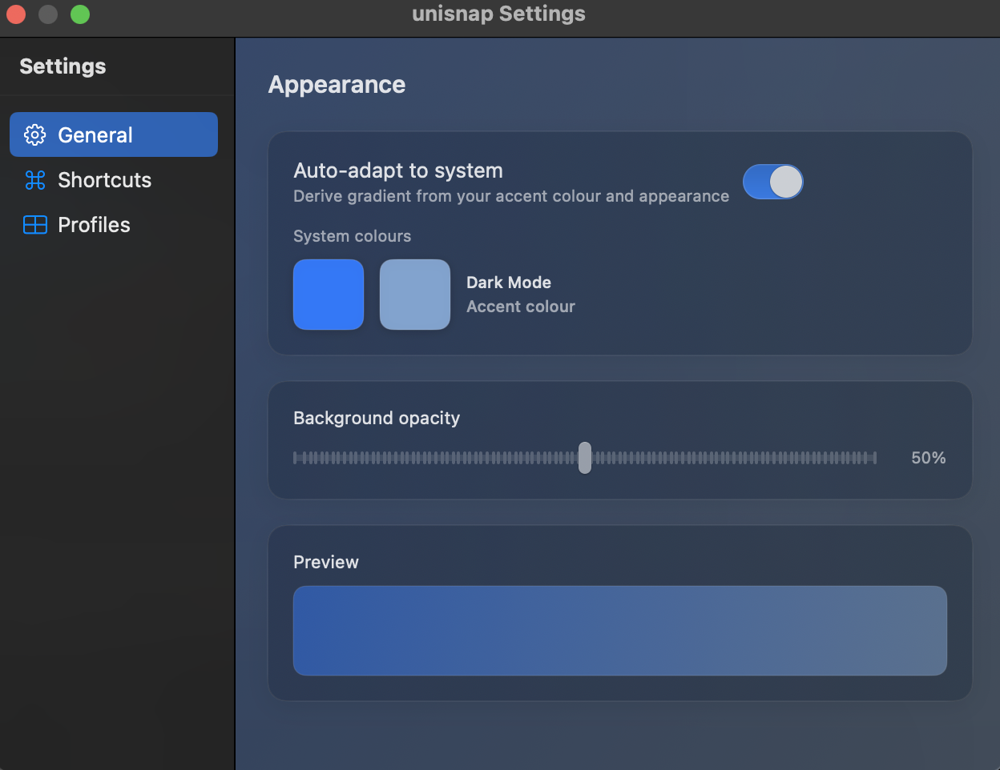

# <p align="center"> Unisnap </p>

<div align="center"> A lightweight macOS toolbar utility for window management. All you now need to organise your windows into custom and efficient workflows is a left mouse button... (also configurable with keyboard shortcuts!).



Submitted as a project for Hack Club.

[](https://hackclub.com)
[](https://apple.com)
[](https://swift.org)
[](LICENSE)</div>

---

## Table of Contents

- [Features](#features)
- [Requirements](#requirements)
- [Installation](#installation)
  - [Pre-built Release](#pre-built-release)
  - [Build from Source](#build-from-source)
  - [Build via CLI](#build-via-cli)
- [Getting Started](#getting-started)
- [Layout Profiles](#layout-profiles)
- [Keyboard Shortcuts](#keyboard-shortcuts)
- [Organize Windows Overlay](#organize-windows-overlay)
- [Theming](#theming)
- [How It Works](#how-it-works)
- [Project Structure](#project-structure)
- [Data Storage](#data-storage)
- [Known Bugs / Limitations](#known-bugs--limitations)
- [Testing](#testing)
- [Contributing](#contributing)
- [License](#license)
- [Author](#author)

---

## Features

- **Customisable Window Snapping**
- **Customisable Window Profiles** (4 Built-in + 3727 possible combinations!)
- **Configurable Global Hotkeys** but you only need a left mouse button!
- **Custom Theming** (can extracts dominant colours straight from your desktop wallpaper, but in beta)
- **Runs all in Toolbar** (no Dock icon, status bar icon dynamically changes with active layout too.)

<div align="center">



</div>

---

## Requirements

| Requirement | Version |
|---|---|
| **macOS** | 14.5 (Sonoma) or later |
| **Xcode** | 15.4 or later |
| **Swift** | 5.0 |
| **Hardware** | Any Mac (Intel/AppleSil) |

> **Note:** I only have a M1 MBP and cannot test for any devices, or macOS versions other than 14.8.5.

---

## Installation

### Pre-built Release

1. Download `unisnap.dmg` from the releases page (or from the repo root)
2. Open the `.dmg` file
3. Drag **Unisnap** into your Applications folder

<div align="center">



</div>

4. Launch Unisnap from Applications 
> **Note:** You will need to option + click the app as I'm not verified (and may be trying to hack into your computer or smth///)
> **Quarantine Issue:** If macOS blocks the app entirely, run this in Terminal to remove the quarantine attribute:
> ```bash
> xattr -d com.apple.quarantine /Applications/Unisnap.app
> ```

5. Grant Accessibility permissions when prompted
> **Note:** Accessibility permissions are required. The app will prompt you and open System Settings automatically; then them on for Unisnap.

<div align="center" style="width: 200px">



</div>

### Build from Source

```bash
# Clone the repository
git clone https://github.com/qubixal/unisnap.git
cd unisnap

# Open in Xcode
open unisnap.xcodeproj
```

In Xcode:

1. Select the **unisnap** scheme from the toolbar
2. Press `Cmd + R` to build and run
3. Grant Accessibility permissions when prompted

### Build via CLI

```bash
# Debug build
xcodebuild -project unisnap.xcodeproj -scheme unisnap -configuration Debug build

# Release build
xcodebuild -project unisnap.xcodeproj -scheme unisnap -configuration Release build
```

---

## Getting Started

### Granting Accessibility Permissions

Unisnap requires Accessibility access to detect and reposition windows. On first launch:

1. A system dialog will appear requesting Accessibility access
2. Click **Open System Settings** (or, navigate to **Privacy & Security > Accessibility**)
4. Enable **Unisnap** in the list
5. **Restart Unisnap.**

### Using Layout Profiles

Click the Unisnap menu bar icon to see available layouts. Favourited profiles appear at the top; others are under **More >**.

<div align="center" style="width: 150px">



</div>

---

## Layout Profiles

### 4 Built-in Profiles

| Profile | Zones | Grid |
|---|---|---|
| **Left/Right** | 2 | 2 × 1 |
| **Thirds** | 3 | 3 × 1 |
| **Quadrants** | 4 | 2 × 2 |
| **Main + 2 Side** | 3 | 4 × 2 |

### Custom Profiles

btw there are 3727 other mathematically conigurable layouts apart from 4 built-in

Open **Settings > Profiles** to create custom layouts:

1. Click **New Profile**
2. Set the grid size (1–4 columns, 1–3 rows)
3. Drag across grid cells to create zones
4. Name your profile and mark it as a favourite if desired

<div align="center">



</div>

---

## Keyboard Shortcuts

Configure global hotkeys in **Settings > Shortcuts**.

| Action | Default | Description |
|---|---|---|
| **Quickcycle** | `Ctrl + Option + ←/→` | Cycle through all profiles |
| **Organise Windows** | `Ctrl + Option + O` | Open to organise window layout |
| **Activate Profile** | Unassigned | Assign a hotkey to a specific profile |

The combination is saved automatically after entering.

<div align="center" style="width: 500px">



</div>

---

## Organise Windows Overlay

The Organise Windows overlay provides a visual way to assign windows to the outlined zones:

1. Activate via hotkey or menu bar
2. Your current layout grid appears full-screen; click a zone to select it
3. A window picker appears showing all open windows with their app icons and titles
4. Select a window to snap it into the chosen zone



---

## Theming

### Automatic Wallpaper Adaptation (Beta)

When enabled, Unisnap extracts dominant colours from your desktop wallpaper using K-means clustering and applies them as a gradient background throughout the app.

- Toggle in **Settings > General > Auto-adapt to Wallpaper**
- Updates dynamically when your wallpaper changes

### Manual Theming

Override automatic theming with custom colours:

1. Open **Settings > General**
2. Disable **Auto-adapt to Wallpaper**
3. Use the colour pickers to select custom gradient colours
4. Adjust the background opacity slider to taste

<div align="center" style="width: 500px">



</div>

---

## How It Works

Unisnap uses the macOS Accessibility API (`AXUIElement`) to:

- Keep track of all visible windows
- Read window attributes (like title, position, size, minimised state)
- Reposition and resize windows to match layout zone coordinates

This configuration is stored locally via `UserDefaults`.
There are no network requests, no cloud, no selling data, no AI, no DLSS, no i don't use Arch btw.

---

## Project Structure

```
unisnap/
├── unisnap/                    # Main app source
│   ├── unisnapApp.swift        # App entry point (SwiftUI lifecycle)
│   ├── AppDelegate.swift       # Menu bar, windows, app lifecycle
│   ├── LayoutProfile.swift     # Data models (Zone, HotkeyCombo, LayoutProfile)
│   ├── HotkeyManager.swift     # Global hotkey monitoring + recorder
│   ├── WindowListHelper.swift  # Window enumeration, snapping, positioning
│   ├── OrganiseView.swift      # Full-screen organise overlay
│   ├── SettingsView.swift      # Settings window (General/Shortcuts/Profiles)
│   ├── ProfileEditorView.swift # Drag-to-create zone grid editor
│   ├── SharedViews.swift       # Reusable UI components
│   ├── ThemingSettings.swift   # Persisted theming preferences
│   ├── WallpaperColors.swift   # Wallpaper colour extraction (K-means)
│   └── Assets.xcassets/        # App icons and accent colour
├── unisnap.xcodeproj/          # Xcode project
├── unisnapTests/               # Unit tests (placeholder)
└── unisnapUITests/             # UI tests (placeholder)
```

---

## Data Storage

All settings are stored locally in `UserDefaults` under the `unisnap_` prefix:

| Key | Contents |
|---|---|
| `unisnap_profiles` | JSON-encoded array of layout profiles |
| `unisnap_quickswap_hotkey` | Quickcycle hotkey combination |
| `unisnap_organise_hotkey` | Organise overlay hotkey |
| `unisnap_theming_autoAdapt` | Wallpaper auto-adapt toggle |
| `unisnap_theming_color1` | Custom gradient colour 1 |
| `unisnap_theming_color2` | Custom gradient colour 2 |
| `unisnap_theming_opacity` | Background gradient opacity |

---

## Known Bugs / Limitations

- **macOS Quarantine** — app isn't signed so macOS may quarantine it. Fix: `xattr -d com.apple.quarantine /Applications/Unisnap.app`
- **Accessibility perms required** — some security software may block unisnap's Accessibility permissions;
- **Menu bar only** — No Dock icon to minimise on-screen footprint. **Force-quit via literally any method if needed.**
- **App Sandbox disabled** — Required for Accessibility API access. dw your data is not being sold in my basement
- **No multi-monitor support** — Layouts only apply to the primary display.
- **Beta Theming** - doesn't work always hence the beta
- **etc** ...

---

## Testing

```bash
xcodebuild test -project unisnap.xcodeproj -scheme unisnap
```

> idk what you want to test there's nothing to test

---

## Contributing

1. Fork the repository
2. Create a feature branch (`git checkout -b feature/my-feature`)
3. Commit your changes
4. Push to the branch (`git push origin feature/my-feature`)
5. Open a Pull Request

Your contribution to this opensource bundle of garbage is greatly appreciated!

---

## License

This project is under the MIT License. 

---

## Author

Created by [qubixal](https://github.com/qubixal) — July 2026
// Come visit my website at [qubixal.xyz](https://qubixal.xyz)!