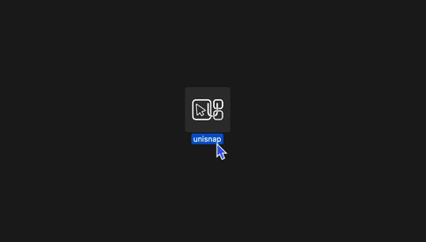

# <p align="center"> unisnap </p>

<div align="center"> A lightweight macOS toolbar utility for window management.


Submitted as a project for Hack Club.

[](https://hackclub.com)
[](https://apple.com)
[](https://swift.org)
[](LICENSE)
[](https://github.com/qubixal/unisnap/releases)</div>

---

## Table of Contents

- [Features](#features)
- [Requirements](#requirements)
- [Installation](#installation)
  - [Pre-built Release](#pre-built-release)
  - [Build from Source](#build-from-source)
  - [Build via CLI](#build-via-cli)
- [Uninstalling](#uninstalling)
- [Getting Started](#getting-started)
- [Layout Profiles](#layout-profiles)
- [Keyboard Shortcuts](#keyboard-shortcuts)
- [Organise Windows Overlay](#organise-windows-overlay)
- [Theming](#theming)
- [How It Works](#how-it-works)
- [Project Structure](#project-structure)
- [Data Storage](#data-storage)
- [Known Bugs / Limitations](#known-bugs--limitations)
- [Testing](#testing)
- [Contributing](#contributing)
- [License](#license)
- [Author](#author)

---

## Features

Why not use rectangle, raycast, etc.?

- **Minimal Footprint**: Runs in the menu bar using as little as **~24MB of memory**
- **Instant workflow**: unisnap configures ALL open windows at once, saving you precious time.
- **Automatic Window Snapping**
- **Customisable Window Profiles** (4 Built-in + 3727 possible combinations!)
- **Configurable Global Hotkeys** (but you only need a left mouse button!)
- **Configurable Theming** (uses accent colour of desktop)

<div align="center">


</div>

---

## Requirements

| Requirement | Version |
|---|---|
| **macOS** | 14.5 (Sonoma) or later |
| **Xcode** | 15.4 or later |
| **Swift** | 5.0 |
| **Hardware** | Any Mac (Intel/AppleSil) |

> **Note:** I only have a M1 MBP and cannot test for any devices, or macOS versions other than 14.8.5.
> **Extended Note:** I now have a M4 MBP and it works... sort of? (26.3 Tahoe)

---

## Installation

### Pre-built Release

1. Download `unisnap.dmg` from the releases page (or from the repo root)
2. Open the `.dmg` file
3. Drag **unisnap** into your Applications folder

<div align="center">


</div>

4. Launch unisnap from Applications 
> **Note:** You will need to **ctrl + click** the app as I'm not verified (and may be trying to hack into your computer or smth///)
> **Quarantine Issue:** If macOS blocks the app entirely, run this in Terminal to remove the quarantine attribute:
> ```bash
> xattr -d com.apple.quarantine /Applications/unisnap.app
> ```
Usually a ctrl + click -> open should fix it though (?)

<div align="center">



</div>

5. Grant Accessibility permissions when prompted
> **Note:** Accessibility permissions are required. The app will prompt you and open System Settings automatically; then them on for unisnap.

<div align="center" style="width: 200px">


</div>

### Build from Source

```bash
# Clone the repository
git clone https://github.com/qubixal/unisnap.git
cd unisnap

# Open in Xcode
open unisnap.xcodeproj
```

In Xcode:

1. Select the **unisnap** scheme from the toolbar
2. Press `Cmd + R` to build and run
3. Grant Accessibility permissions when prompted

### Build via CLI

```bash
# Debug build
xcodebuild -project unisnap.xcodeproj -scheme unisnap -configuration Debug build

# Release build
xcodebuild -project unisnap.xcodeproj -scheme unisnap -configuration Release build
```

---

## Uninstalling

1. Quit unisnap from the menu bar (or force-quit)
2. Delete the app by dragging to bin / right click > delete / terminal:
   ```bash
   rm -rf /Applications/unisnap.app
   ```
3. Remove stored preferences:
   ```bash
   defaults delete com.qubixal.unisnap
   ```
4. (Optional) Revoke Accessibility permissions in **System Settings > Privacy & Security > Accessibility**.

---

## Getting Started

### Granting Accessibility Permissions

unisnap requires Accessibility access to detect and reposition windows. On first launch:

1. A system dialog will appear requesting Accessibility access
2. Click **Open System Settings** (or, navigate to **Privacy & Security > Accessibility**)
3. Enable **unisnap** in the list
4. **Restart unisnap.**

### Using Layout Profiles

Click the unisnap menu bar icon to see available layouts. Favourited profiles appear at the top; others are under **More >**.

<div align="center" style="width: 150px">


</div>

---

## Layout Profiles

### 4 Built-in Profiles

| Profile | Zones | Grid |
|---|---|---|
| **Left/Right** | 2 | 2 × 1 |
| **Thirds** | 3 | 3 × 1 |
| **Quadrants** | 4 | 2 × 2 |
| **Main + 2 Side** | 3 | 4 × 2 |

### Custom Profiles

Open **Settings > Profiles** to create custom layouts:

1. Click **New Profile**
2. Set the grid size (1–4 columns, 1–3 rows)
3. Drag across grid cells to create zones
4. Name your profile and mark it as a favourite if desired

<div align="center">


</div>

---

## Keyboard Shortcuts

Configure global hotkeys in **Settings > Shortcuts**.

| Action | Default | Description |
|---|---|---|
| **Quickcycle Forward** | `Ctrl + Option + →` | Cycle forward through profiles |
| **Quickcycle Backward** | `Ctrl + Option + ←` | Cycle backward through profiles |
| **Organise Windows** | `Ctrl + Option + O` | Open to organise window layout |
| **Activate Profile** | Unassigned | Assign a hotkey to a specific profile |

The combination is saved automatically after entering.

<div align="center" style="width: 500px">


</div>

---

## Organise Windows Overlay

The Organise Windows overlay provides a visual way to assign windows to the outlined zones:

1. Activate via hotkey or menu bar
2. Your current layout grid appears full-screen; click a zone to select it
3. A window picker appears showing all open windows with their app icons and titles
4. Select a window to snap it into the chosen zone


---

## Theming

### Automatic System Adaptation

When enabled, unisnap creates a gradient theme from your system accent colour Toggle in **Settings > General > Auto-adapt to System**.

### Manual Theming

Or, bring your own two colours:

1. Open **Settings > General**
2. Disable **Auto-adapt to System**
3. Use the colour pickers to select colours + adjust the background opacity slider.

<div align="center" style="width: 500px">


</div>

---

## How It Works

unisnap uses the macOS Accessibility API (`AXUIElement`) to:

- Keep track of all visible windows
- Read window attributes (like title, position, size, minimised state, minimum size)
- Reposition and resize windows to match layout zone coordinates
- Auto-swap windows into larger zones when they don't fit their assigned zone

This configuration is stored locally via `UserDefaults`.
There are no network requests, no cloud, no selling data, no AI, no DLSS, no i don't use Arch btw.

---

## Project Structure

```
unisnap/
├── unisnap/                    # Main app source
│   ├── unisnapApp.swift        # App entry point (SwiftUI lifecycle)
│   ├── AppDelegate.swift       # Menu bar, windows, app lifecycle
│   ├── LayoutProfile.swift     # Data models (Zone, HotkeyCombo, LayoutProfile)
│   ├── HotkeyManager.swift     # Global hotkey monitoring + recorder
│   ├── WindowListHelper.swift  # Window enumeration, snapping, positioning
│   ├── OrganiseView.swift      # Full-screen organise overlay
│   ├── SettingsView.swift      # Settings window (General/Shortcuts/Profiles)
│   ├── ProfileEditorView.swift # Drag-to-create zone grid editor
│   ├── SharedViews.swift       # Reusable UI components
│   ├── ThemingSettings.swift   # Persisted theming preferences
│   ├── SystemThemeProvider.swift # System accent + appearance provider
│   └── Assets.xcassets/        # App icons and accent colour
└── unisnap.xcodeproj/          # Xcode project
```

---

## Data Storage

All settings are stored locally in `UserDefaults` under the `unisnap_` prefix:

| Key | Contents |
|---|---|
| `unisnap_profiles` | JSON-encoded array of layout profiles |
| `unisnap_quickswap_hotkey` | Quickcycle forward hotkey combination |
| `unisnap_quickswap_reverse_hotkey` | Quickcycle backward hotkey combination |
| `unisnap_organise_hotkey` | Organise overlay hotkey |
| `unisnap_theming_autoAdapt` | Theming auto-adapt toggle |
| `unisnap_theming_color1` | Custom gradient colour 1 |
| `unisnap_theming_color2` | Custom gradient colour 2 |
| `unisnap_theming_opacity` | Background gradient opacity |

---

## Known Bugs / Limitations

- **macOS Quarantine** — app isn't signed so macOS may quarantine it. Run `xattr -d com.apple.quarantine /Applications/unisnap.app` (but usually ctrl+click → open works as per guide)
- **Accessibility perms required** — some security software may block unisnap's Accessibility permissions
- **Menu bar only** — No Dock icon as part of design. Force-quit if hanging via force quit menu if needed.
- **App Sandbox disabled** — Required for Accessibility API access. dw your data is not being sold in my basement
- **No multi-monitor support** — Layouts only apply to the primary display

---

## Contributing

1. Fork the repository
2. Create a feature branch (`git checkout -b feature/my-feature`)
3. Commit your changes
4. Push to the branch (`git push origin feature/my-feature`)
5. Open a Pull Request

Your contribution to this opensource bundle of garbage is greatly appreciated!

---

## License

This project is under the MIT License. 

---

## Author

Created by [qubixal](https://github.com/qubixal) — July 2026
// Come visit my website at [qubixal.xyz](https://qubixal.xyz)!
